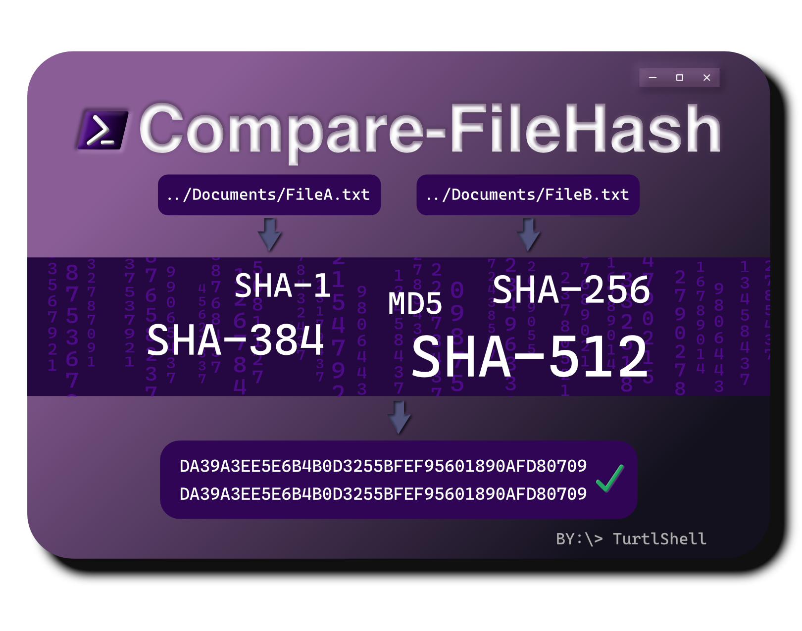

<a name="top"></a>
<p align="center">
	
	<sup>Artwork by <a href="https://github.com/Rjshome">@Rjshome</a></sup>
	<br>
	<a href="LICENSE"></a>
	
	
</p>

Compare-FileHash is a native PowerShell (3.0+) cmdlet which can be used to compare the hash values of a list of files, against each other or an expected hash outcome, using various hashing algorithms. 

SHA512 is used by default, but you may specify which algorithm(s) you wish to use.

Compare-FileHash prints the result of each hash for each file (unless '-Quiet' is passed), and if all algorithms' hashes match (or the first, if '-Fast' is passed), it will return 'MATCH'. If any hash does not match, it will return 'MISMATCH'.

## Table of Contents 🗂️

- [Installation & Setup](#installation)
- [Usage](#usage)
- [Parameters](#parameters)
- [Algorithms](#algorithms)
- [License](#license)
- [Contribution](#contribution)
<a name="installation"></a>
## Installation & Setup 🔧

Automatic, from [PowerShell Gallery](https://www.powershellgallery.com/packages/Compare-FileHash/) (recommended):
```
PS > Install-Module -Name Compare-FileHash
```

Manual¹: [Download](https://github.com/turtlshell/Compare-FileHash/archive/refs/heads/main.zip) the zip directly, or [install](https://github.com/git-guides/install-git) & use Git from PowerShell:
```
# Clone this repository
PS > git clone https://github.com/turtlshell/Compare-FileHash.git

# CD into the repository directory
PS > cd Compare-FileHash

# (Optional, depending on your security settings) Set execution policy to allow this script to run
PS > Set-ExecutionPolicy Bypass -Scope Process

# Import the file
PS > . .\Compare-FileHash.ps1
```
<sup>¹ Installing using this method will require you to manually dot source (. .\\) the file each time you wish to use the module.</sup>
<a name="usage"></a>
## Usage 💡

1. Import the file into your PowerShell session (only necessary if you installed using the manual method):
```
PS > . .\Compare-FileHash.ps1
```

2. Use the cmdlet (examples):

- Compare SHA512 of two files:
```
PS > Compare-FileHash -Files 'C:\file1.txt','C:\file2.txt'
```

- Compare SHA512 of multiple files, suppressing individual hash results:
```
PS > Compare-FileHash -Files 'C:\file1.txt','C:\file2.txt','C:\file3.txt' -Quiet
```

- Compare all algorithms' hashes of two files and accept the first hash match, skipping subsequent algorithms:
```
PS > Compare-FileHash -Files 'C:\file1.txt','C:\file2.txt' -Fast -Algorithms All
```

- Compare the specified algorithm's hashes of two files:
```
PS > Compare-FileHash -Files 'C:\file1.txt','C:\file2.txt' -Algorithms SHA1,SHA256,SHA384
```

- Compare a file's SHA1 against its expected SHA1, automatically deriving desired algorithm from hash length:
```
PS > Compare-FileHash -Files 'C:\file1.txt' -Expected DA39A3EE5E6B4B0D3255BFEF95601890AFD80709
```
<a name="parameters"></a>
## Parameters ⚙️

#### 📁 -Files (mandatory)

The list of file paths, separated by commas, from which to compare the hashes. A minimum of two paths must be supplied (or one path, if '-Expected' is passed), however there is no upper limit.

#### 🧮 -Algorithms (optional)

Determines which algorithm(s) are used to compute the specified files' hashes. You may pass any number of [algorithms](#algorithms), separated by commas. Passing 'All' will run all algorithms. When unspecified, SHA512 will be used.

#### ✔️ -Expected (optional)

Allows you to specify the hash you are expecting, and compares the file(s) against it, rather than against each other. Passing this switch reduces the minimum '-Files' limit from 2 to 1. Cannot be passed with '-Algorithms'

#### 🔇 -Quiet (optional)

Suppresses the individual hash values from being printed; only the result, ('MATCH' or 'MISMATCH'), will be printed.

#### ⚡ -Fast (optional)

Returns 'MATCH' if the first algorithm's hashes match, skipping the calculation of any subsequent hashes.
<a name="algorithms"></a>
## Algorithms 🧮

Compare-FileHash supports all algorithms which are supported by Get-FileHash. As of right now, those are:

- SHA512
- SHA384
- SHA256
- [SHA1](https://en.wikipedia.org/wiki/SHA-1#Attacks)²
- [MD5](https://en.wikipedia.org/wiki/MD5#Security)²

See Microsoft's help page on [Get-FileHash](https://learn.microsoft.com/en-us/powershell/module/microsoft.powershell.utility/get-filehash#parameters) for more information.

<sup>² Please note that these algorithms are considered [insecure](https://en.wikipedia.org/wiki/SHA-1#Comparison_of_SHA_functions). If you're dealing with something sensitive, consider using SHA256 or above.</sup>
<a name="license"></a>
## License

This project is licensed under the GNU General Public License v3.0 - see the [LICENSE](LICENSE) file for details.
<a name="contribution"></a>
## Contribution

Contributions/issues are welcome. I will consider feature requests if I like your idea and I feel it has a strong use-case. Feel free to check the [issues page](https://github.com/turtlshell/Compare-FileHash/issues) if you want to contribute.

Drop a ⭐️ if you found this useful!

This readme was last updated on July 29, 2023.

[⬆️ Back to top ⬆️](#top)
